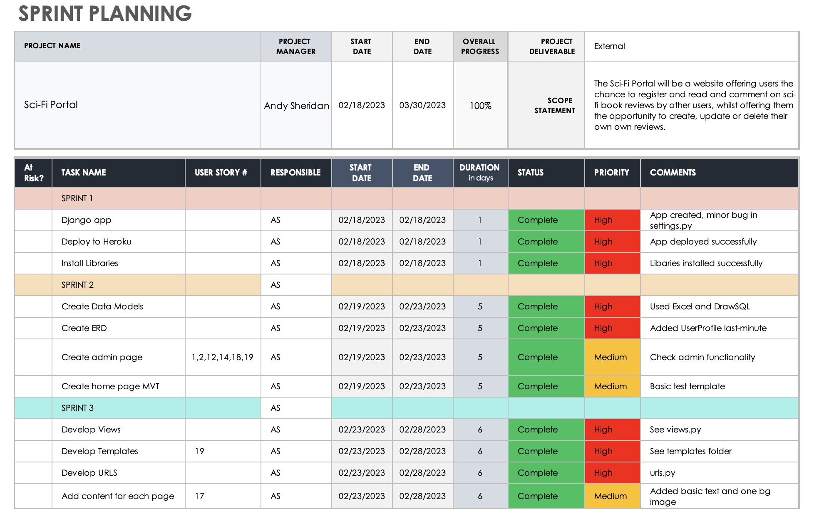
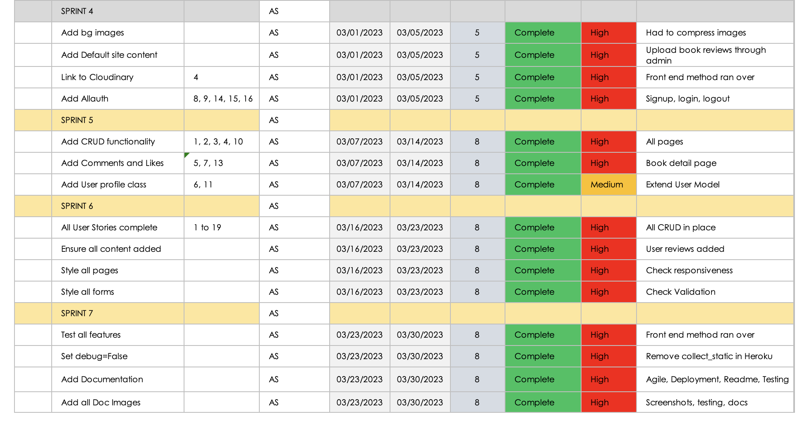
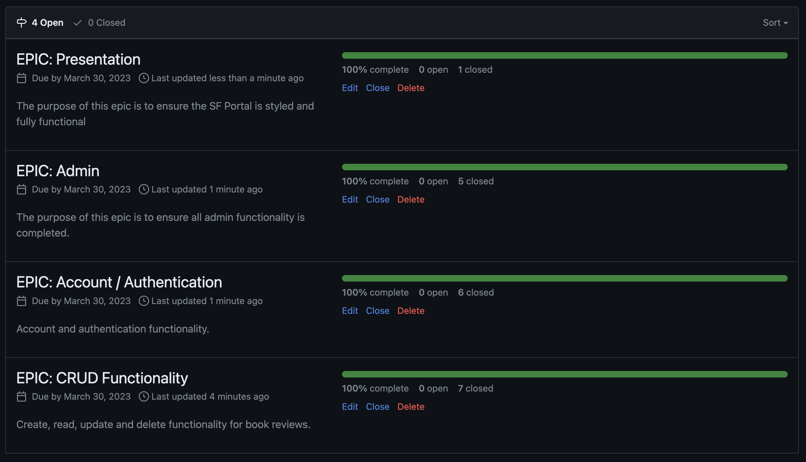
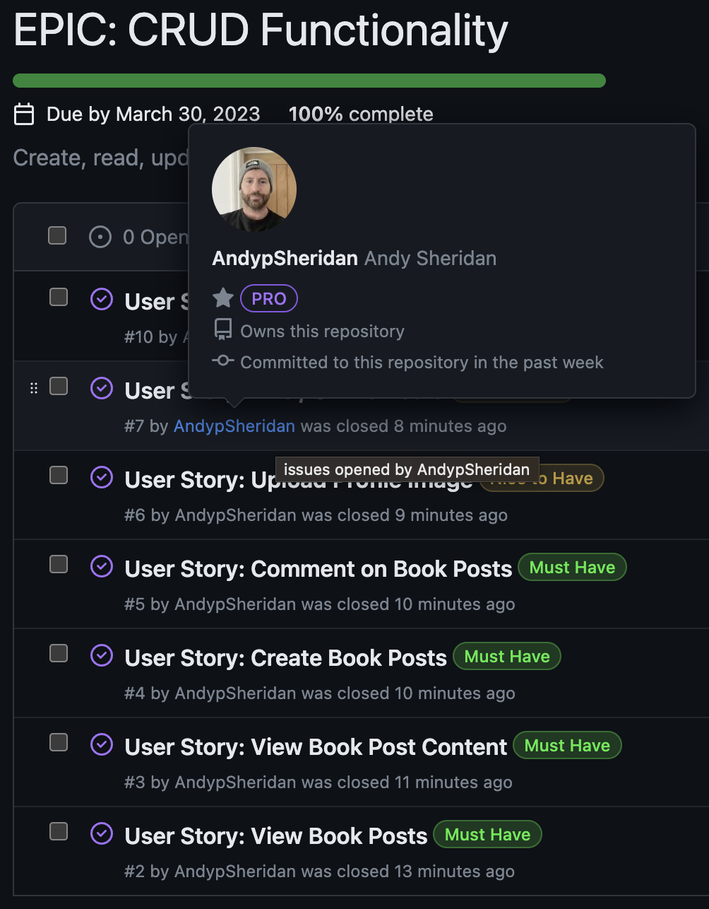
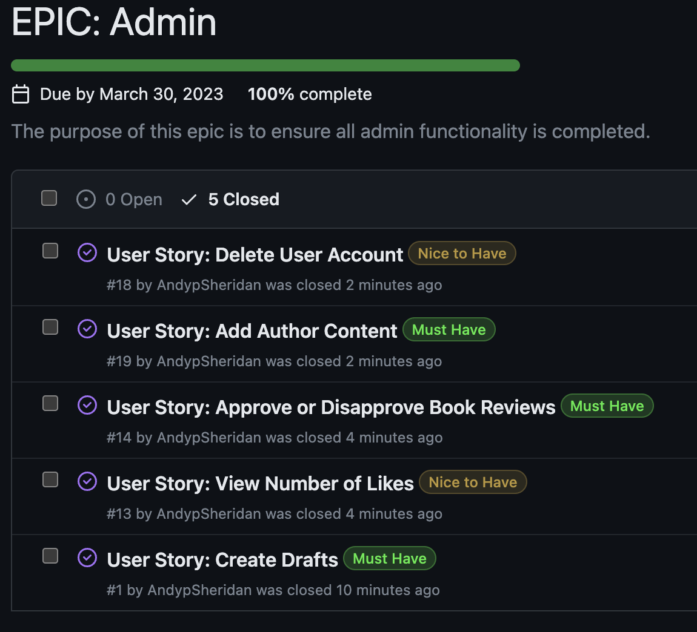
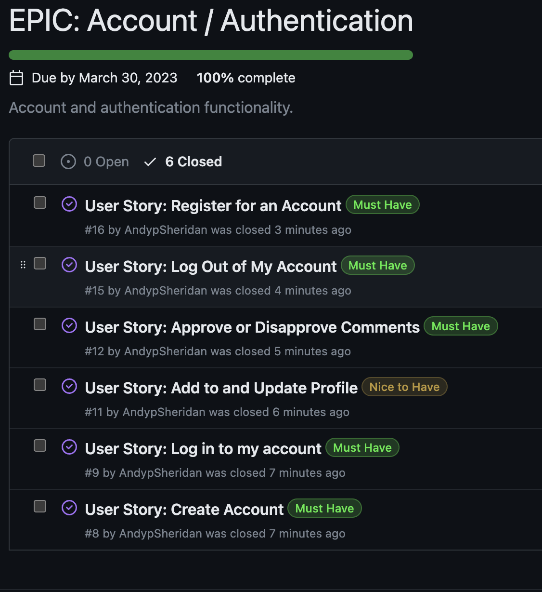
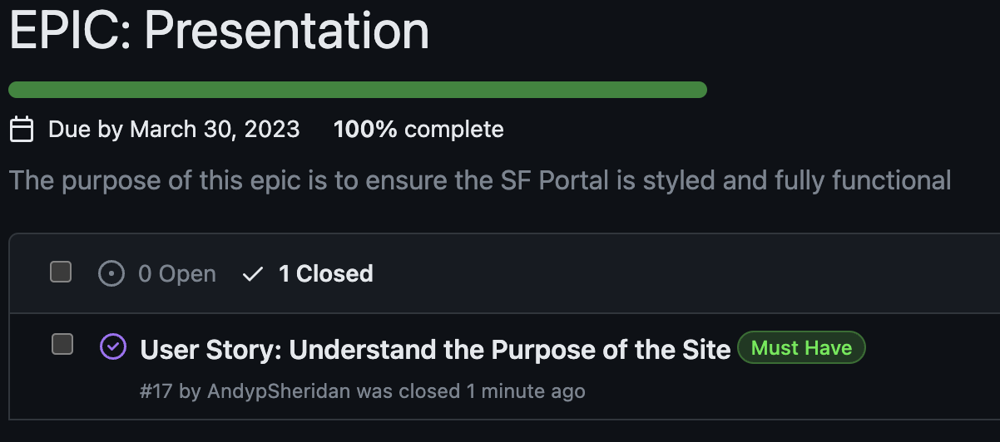

# Agile Methodologies

* **Agile Methodologies**
  * [Overview](#overview)
  * [Sprint Notes](#sprint-notes)
    * [Sprint 1](#sprint-1)
    * [Sprint 2](#sprint-2)
    * [Sprint 3](#sprint-3)
    * [Sprint 4](#sprint-4)
    * [Sprint 5](#sprint-5)
    * [Sprint 6](#sprint-6)
    * [Sprint 7](#sprint-7)
  * [Epics](#epics)
  * [Learning Outcomes](#learning-outcomes)

## **Overview**

This was my first attempt at developing a project using Agile Methodologies and I encountered challenges, and some occasional confusion, along the way. The first challenge was the plethora of information I had absorbed in a short space of time. I was attempting to apply a number of Agile methods and use various different platforms to help the planning process: 

I used a [Smartsheet](https://www.smartsheet.com) template to help plan my sprints for this project:

I used the Github [project board](https://github.com/users/AndypSheridan/projects/2) to create and track issues and User Stories. I then integrated these within my Smartsheet template.

This proved instrumental in keeping me focused on tasks and creating the necessary features for the project. As this was my first experience of using Github projects, I found that on several occasions I underestimated or overestimated the amount of time and/or tasks for each particular sprint but, on the whole, the schedule worked well. Using the Milestones feature I created Epics in Github and to these I added my User Stories, although I had already begun work on the by this point. I also created labels for the project was extremely helpful when it came to prioritising requirements for the project. 

It has been a steep learning curve, and I felt that my plan was continually evolving rather than being something I rigidly adhered to. On reflection, I consider this to be a good thing in some respects.

I have outlined a brief summary of these below:

### *Sprint 1*

* February 18-19 2023
  * Install django app and libraries, deploy to Heroku

The purpose of this short sprint was to create a functioning Django app and immediately deploy it to Heroku with the initial libraries I intended to use. The first deployment failed due to a typo in the settings.py file but this was corrected and the app deployed as expected.

### *Sprint 2*

* February 19-23 2023
  * Create data models and basic structure of home page and admin

This sprint was slightly longer and focused on creating the ERD using DrawSQL, then realising these in models.py. Once this step was done, I developed the structure for the home page view, template and url. I then created the admin area in admin.py. Whilst I achieved all of this ahead of schedule, it became clear that this was a steep learning process and that my planning could have been more thorough. I resolved to take more time outlining my next sprint.

### *Sprint 3*

* February 24-28 2023
  * Create basic structure of site and test content for each page

Sprint 3 involved developing views, templates and urls for the main pages of the site. This is when the project board became an invaluable reference point. There were two occasions when the project as a whole seemed quite overwhelming but the project board helped to keep me focused. I did find that I had not been specific enough with some user stories so I edited these and added several more as I became more familiar with the process. This sprint finished ahead of schedule on the 27th.

### *Sprint 4*

* March 1-5 2023
  * Add background images, add content for User to view, set up layout for all pages

Sprint 4 took slightly longer than expected. The purpose of this was to add all background images and provide the User with a front end method to upload book photographs. Due to some image size and resolution issues, plus a lack of familiarity with the Cloudinary platform, it took longer than expected to achieve, so I finished this sprint on the 7th March.

### *Sprint 5*

* March 7-14 2023
  * Enable CRUD functionality where necessary, add User profile

I allowed a week for sprint 5. The purpose was to add all site content, navigation and ensure CRUD functionality worked in all instances where the admin or user needed it. These included adding a comment or review and editing or deleting a review. Initially I was ahead of schedule, but progress was significantly disrupted when it came to adding a user profile so this meant the sprint was not finished until the 15th March.

### *Sprint 6*

* March 16-23 2023
  * Ensure all user stories actioned, finalise styling of all content, forms and pages

This was another week-long sprint. With all User Stories working as intended, the aim of this sprint was to refine the appearance of the site and perform testing. In a meeting with my mentor towards the end of the sprint, some minor styling issues were identified, all subsequently actioned. A major problem came when setting debug=False in the settings.py file. The project then failed to deploy or if it did, there would be no access to my static files. This wasted a crucial day of the project and put me slightly behind. I finished this sprint on the 24th.

### *Sprint 7*

* March 24-30 2023
  * Final testing and complete all project documentation

## **Epics**

As I developed my Epics, it became clear that my initial planning could have been better organised and using the Epics would have helped keep my project more focused. For example, I could have added Developer Tasks and further User Stories that needed to be completed in order to have a more centralised platform to refer to. Although the project was completed successfully and on time, I still feel compelled to take better advantage of the features that Github offers when it comes to my next project.

This project was divided into four Epics, using Github Milestones. The User Stories were then each assigned an Epic:

 

### 1. CRUD Functionality

It was crucial to ensure CRUD functionality so all CRUD-related User Stories were linked to this milestone:

 

### 2. Admin

All Admin-related User Stories were linked to this milestone:

 

### 3. Account and Authentication

All Account and Authentication-related User Stories were linked to this milestone:

 

### 4. Presentation

Presentation-related User Stories were linked to this milestone.

 

## Learning Outcomes

I have enjoyed this project and it has been a wonderful learning experience. I think this first attempt using Agile methodologies has set me on a course I look forward to refining and developing continually. For future projects, I intend to better document all Developer Tasks, Sprints and User Stories within Github Projects.

[Back to Readme](/README.md)