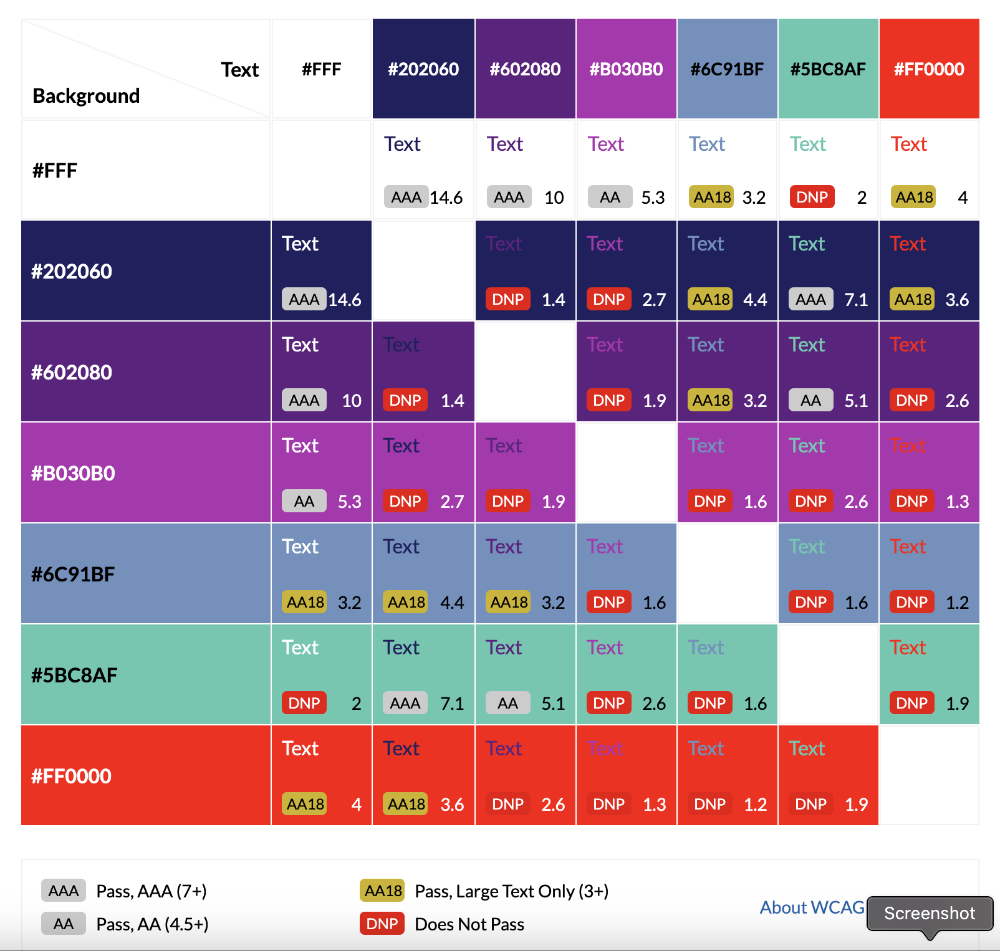

# **Sci-Fi Portal**
## **Site Overview**

As a keen fan of the Science Fiction genre, I have often struggled to keep track of the growing number of books I have read. I have also struggled to find the passion and love for sci-fi from others within my own social or professional circles.

The Sci-Fi Portal is designed with the aim of creating an online community of like-minded fans who would like to share their own experiences of sci-fi novels, short stories or animé. Users can create, edit and delete book reviews which can be viewed by themselves as well as other registered users. The community experience is enhanced by the ability comment on reviews, thus generating discussion and fulfilling one of the aims of providing a forum to interact and engage with other fans of the genre.

Click [here](https://sci-fi-portal.herokuapp.com/) to see the final deployment of the site.

## Table of contents:
1. [**Site Overview**](#site-overview)
1. [**Planning stage**](#planning-stage)
    * [**Strategy**](#strategy)
      * [***Site Aims***](#site-aims)
      * [***Target Audiences***](#target-audiences)
      * [***User Stories***](#user-stories)
      * [***Wireframes***](#wireframes)
      * [***Database Schema***](#database-schema)
      * [***Color Scheme***](#color-scheme)
      * [***Typography***](#typography)
1. [**Agile Development**](#agile-development)
1. [**Features**](#features)
    * [***Navbar***](#navbar)
    * [***Home Page***](#home-page)
    * [***Books Page***](#books-page)
    * [***Booke Detail Page***](#book-detail-page)
    * [***Authors Page***](#authors-page)
    * [***Authors Page***](#authors-page)
    * [***Authors Page***](#authors-page)
    * [***Authors Page***](#authors-page)
1. [**Future-Enhancements**](#future-enhancements)
1. [**Testing Phase**](#testing-phase)
1. [**Deployment**](#deployment)
1. [**Tech**](#tech)
1. [**Credits**](#credits)
    * [**Content**](#content)
    * [**Media**](#media)
    * [**Honourable mentions**](#honorable-mentions)

## **Planning Stage**

### **Site Aims:**

* Develop a colourful, interactive online platform for fans of Science Fiction literature to come together as a community.
* To provide users with a platform to keep track of their own reading within the genre.
* Deliver an accessible and easy to navigate site for users on desktop and mobile devices.
* Provide registered users with the opportunity share their own sci-fi experiences and to Create, Read, Update or Delete book reviews on the site.
* Provide users with an opportunity to gain future reading inspiration by browing the book reviews and featured authors.
* Offer users the opportunity to interact and engage with others by liking and commenting on reviews by other users.
* Ensure provision of safe content as reviews and comments must be approved by the admin.
* Enhance the user experience by using an integrated search function for those trying to find a specific book or author.
* Offer users the opportunity to provide more information about themselves by adding to their user profile.
* Deliver to the user a comprehensive explanation and rationale behind the site through a clear and concise About page. 

### **Target Audiences:**

* People who are fans of Science Fiction books.
* People who are fans of the genre in general.
* People looking to share their own reading experiences from within the genre.
* People looking for a an online book-club which is easy to sign up to and easy to navigate.
* People who would like to comment on other reviews in order to discuss these books.
* People seeking future reading inspiration.
* People who are new to the genre and would like to engage with the community.

### **User Stories:**

#### **Site User**
As a **Registered** user I can: 
* *create draft book posts* in order for *admin to approve and post them after reviewing*.
* *view a list of book posts* in order to *select one to read*.
* *click on a book post* in order to *view its content*.
* *create a book post* in order to *share my review with the community*.
* *comment on other users' book posts* in order to *share my opinions and interact with the community*.
* *upload a profile picture or bio* in order to *tell a little more about myself*.
* *edit or update my profile* in order to *keep my account up to date*.
* *like or unlike a book review* in order to *interact with the site content*.
* *easily login* in order to *access my account*.
* *easily logout* in order to *end my session on the site*.
* *edit or delete my own book post* in order to *keep my own contributions relevant*.

As an **Unregistered** User I can:
* *easily determine the purpose of the site* in order to *see if I want to register and join*.
* *easily register* in order to *start interacting with the content and community*.

#### **Site Admin**
As a **Site Admin** I can: 
* *approve user book reviews* in order to *publish them to the site*.
* *approve user book reviews* in order to *check that their content is appropriate*.
* *approve user comments* in order to *filter out objectionable content*.
* *view the number of likes on a book review* in order to *see which is the most popular*.
* *delete user accounts* in order to *remove users who do not respect others in the community*.
* *add to the featured authors section* in order to *keep site content fresh and relevant*.

### **Wireframes**

I used [Figma](https://www.figma.com) to help guide my design process for this project. I wanted to use a programme which would help me visualise the pages a little clearer than Balsamiq Wireframes, which I have used in the past. As images and colours are a key part of this site's look and feel, I wanted to feel happy they worked in planning before committing.

* [Homepage](docs/wireframes/sfp-index-wireframe.png)
* [About Page](docs/wireframes/sfp-about-wireframe.png)
* [Books Page](docs/wireframes/sfp-books-wireframe.png)
* [Authors Page](docs/wireframes/sfp-authors-wireframe.png)
* [Book / Author Detail Page](docs/wireframes/sfp-detail-wireframe.png)
* [User Account Page](docs/wireframes/sfp-account-wireframe.png)
* [Submit Review Page](docs/wireframes/sfp-submit-review-wireframe.png)

The final site adheres fairly closely to the initial images. I dropped the fixed-bottom footer as it interfered with site content on some devices. I moved the social media and email links to the tight side of the navbar where they worked better anyway.

The edit, delete and search result pages do not have images here as they are either simple forms or last-minute additions.

### **Database Schema**

I used [DrawSQL](https://drawsql.app)​ to help visualise my database tables. See the image below:

Unfortunately, the site did not provide adequate field type values but it was intrumental in helping create the Entity Relationship Diagram.

The exact models used in the project can be viewed [here](docs/data-model/sfp-data-models.png).

### **Colour Scheme:**
​
After researching various options for this project, I opted for the color scheme below:

The contrast scores for the colours in this palette can be seen below. I used [contrast-grid](https://contrast-grid.eightshapes.com/) to generate this chart.

​

#### **Typography**
​
I researched a number of fonts that would be in keeping with the sci-fi theme of the site. I used [Font Pair](https://www.fontpair.co/inspiration/space-mono-roboto-mono) to try a number of options and eventually chose the following:

* [Space Mono](https://fonts.google.com/specimen/Space+Mono)
Chosen for its sci-fi-esque appearance.

* [Roboto](https://fonts.google.com/specimen/Roboto)
Chosen for its softer edges to counter the harsher appearance of Space Mono.

The two are used evenly throughout the site.

​

## Agile Development

I used Github projects to create and track issues and User Stories. The Agile processes and methodologies can be viewed [here](/AGILE.md)

 

 

# **Features**

## **Site Navigation**

### **Navbar**
​
The Navbar is a bootstrap component which allows a registered User to navigate their way around the site with ease. When logged out, it displays just the SF|Portal logo and social media / email links:

When the User is logged in, it offers navigation to the profile, books, authors and about pages:

To display properly on smaller screens, I used a Bootstrap hamburger menu:

### **Home Page**

The Home Page uses a background chosen to evoke sci-fi imagery and features a human figure standing in front of a Portal, thus linking neatly with the name of the site. It features some simple text outlining the purpose of the site as well as a search bar, which logged-in Users can use to search for content:

The Home Page is responsive and works well on smaller devices. This is how it looks on an iPhone SE:

Users can search for books using the search function:

### **Books Page**

The Books Page features a background image of stars which complements the overall colour palette of the site. It consists of a 'Submit Review' button and a paginated list of book reviews made by other Users or Admin. Each review is a Bootstrap card displaying the title, author and an image of the book. If no image is uploaded by the User, it is assigned a default image showing 'Image not available'. This can always be assigned by Admin or the User at a later time. The card also displays a snippet of the synopsis, a User rating, who posted the review the number of likes and comments. 

There are a maximum of six reviews per screen, the User can click 'next' or 'previous' to navigate between the reviews:

The Books page is responsive on smaller screens and the reviews will stack so they can be scrolled. The following screenshot is from an iPhone SE:

Assuming the User is logged in, they are able to edit or delete reviews they have posted directly from the Books Page:

The User can click on any of the book titles or images to go to the Book Detail page and read that particular review.

### **Book Detail Page**

Upon clicking on a review in the Books Page, the User is taken to the Book Detail page:

This dislays a larger image of the book - if uploaded, the book title, author, review rating and synopsis. The User review is situated below and there is also the opportunity for a User to edit or delete their own reviews. Users can also like or unlike reviews as well as see the number of both:

***Likes***

The like button has two states: a [Font Awesome](https://fontawesome.com/) heart outline if the user has not liked the review:

or a solid heart if the user has liked it:

The User can like or unlike a review.

***Comments***

Comments can be viewed below the reviews. This displays the User posting the comment, the date and time as well as the comment itself:

**NOTE** All comments must be approved by the Admin in order to filter out objectionable content.

In order to post a comment, the User must complete the comment form at the bottom of the page:

Upon submission of the form, they are presented with the following message:

When the comment has been approved by the Admin, they will appear with the other comments in the order they were posted.

### Edit Book Page

#### **Pre-Game**

* The same os function is used to clear the terminal once again. The ship_type method is called so the user is presented with the four different types of ships at their disposal, along with the size of each. The ships are displayed sequentially in descending size order, on a slight delay using the time library.

* Upon pressing enter, the game_rules function is called to display the symbols which will be used on the game boards. Once the user has processed the information, they are prompted to press enter again.

* The following text explains the win condition which states that ten hits will be enough to win the game. There is a final prompt to press enter.

* os is used to clear the screen once again and the player board is printed to the terminal. It displays the player name and the shield strength at the starting value of 10. The place_ships method is called so the player is asked to place each ship by choosing whether it will be aligned horizontally or vertically. Any input other than 'h'/'H' or 'v'/'V' will be invalid and the user will be asked to try again. The process will loop until all ships have been assigned coordinates.

#### **Gameplay**

* The populate_boards method adds the user and CPU ships to their respective boards. The user cannot see where the CPU ships are. The game is set up so the user goes first. The player_attack method takes input from the user to guess enemy ship coordinates on the x and y axes. The first CPU guess is a random choice on the board. Upon a successful hit, the CPU will attempt to guess on an adjacent tile. Click the highlighted text to see screenshots of the player entering invalid [row](assets/images/bs77-invalid-row.png) or [column](assets/images/bs77-invalid-column.png) coordinates. The user cannot enter the same coordinates twice. Most of the game logic is in the play_game function which handles updating and appending the relevant boards. It also handles decrementing the shield counter. The game will continue to run until either the player or CPU shield counters reaches zero.

#### **Game Over** 

* Upon winning or losing the game, an ASCII-based message is displayed before the user is given the option of playing a new game. If this option is chosen, the game resets and starts from the beginning. If the user chooses to quit, they are presented with s short message in keeping with the theme of the game.

 

​
## **Future-Enhancements**
​
There are a several areas with scope for future improvement. This project has been very challenging and ultimately the project deadline was looming. I would have liked to add the following:
​
* Adding a player vs player option.
* The option of skipping the rules and legend for returning players.
* The option to randomly place player ships for quicker games.
* An option to have small, medium or large boards with corresponding ship sizes.

​
## **Testing Phase**
​
**Functionality**

* Implementation 🏭: I wanted to make sure the game performed as expected from start to finish.
* Test 🧪: I played the game on a local terminal and on Heroku over thirty times.
* Result 🏆: The game worked as anticipated with no errors.
* Verdict ✅: Test passed.

 

* Implementation 🏭: Check the input validation was working as expected.
* Test 🧪: Invalid inputs and types were entered multiple times at all possible opportunities.
* Result 🏆: The validation worked well. There were no occasions when it was possible to enter an invalid input.
* Verdict ✅: Test passed.

 

* Implementation 🏭: I wanted to make sure the game performed as expected from start to finish.
* Test 🧪: I played the game on a local terminal and on Heroku over thirty times.
* Result 🏆: The game worked as anticipated with no errors.
* Verdict ✅: Test passed.

 

* Implementation 🏭: Check the game ends as expected and offers the play again option upon completion.
* Test 🧪: I played the game multiple times, winning and losing. I selected play again and quit at random.
* Result 🏆: The game worked as anticipated with no errors.
* Verdict ✅: Test passed.
 
​
**Validators**

* The PEP8 Online Validator was down when creating this project, however I added a PEP8 validator to my workspace by running the command: "pip3 install pycodestyle". The results can be found [here](assets/images/bs1977-pycodestyle.png)

* The validator flags a number of minor warnings, all of which are related to the use of the ASCII art used in the start screen, win screen and lose screen functions. In my final mentor session, I was informed these are inconsequential and can essentially be ignored as they do not affect the program itself.

​
​
## **Bugs**
​
The following bugs were identified during user testing:

* 🐞 - When running the game it was possible for the user and CPU to place ships so that they overlapped.
* ⚒️ - There were errors in the check_ship_placement method of the code.
* ✅ - I made adjustments to the method to prevent any overlap.

 

* 🐞 - It was possible for both player and CPU to place ships off the board.
* ⚒️ - There was an error in the populate_boards method.
* ✅ - The entire method was re-written to take into account zero indexing.

​ 

* 🐞 - Upon re-writing the populate boards method, ship x and y coordinates were reversed so ships did not orient correctly.
* ⚒️ - There was an error with the for loop in the nested if statement in the populate boards method.
* ✅ - I reversed the values for row and column and this fixed the bug.

 

* 🐞 - The original SCSS background worked well on a MacBook Pro but caused huge lag and unplayable game quality on some devices.
* ⚒️ - The SCSS was too CPU intensive on some devices.
* ✅ - I used a different background animation which was more subtle but works on all devices in testing.

 

* 🐞 - The game was printing too much text for the size of the terminal so the screen was overloaded with information.
* ⚒️ - There is a lot of information to deliver to the user and it all displayed at once which could be overwhelming.
* ✅ - Imported the os and time libraries so I could clear the terminal before delivering the next stage of the game, time was used to slow down printing to the terminal and also simulate computer thinking.

 

## **Unfixed Bugs**

* There are no known unfixed bugs.

## **Deployment**

## ***Final Deployment to Heroku:***  
  
The project was deployed to [Heroku](https://www.heroku.com) using the below procedure:-    
  
1. **Log in to Heroku** or create an account if required.
1. **click** the button labeled **New** from the dashboard in the top right corner, just below the header.
1. From the drop-down menu **select "Create new app"**.
1. **Enter a unique app name**. I chose battleships-1977 for this project, for reasons stated above.
1. Once the web portal shows the green tick to confirm the name is original **select the relevant region.** In my case, I chose Europe as I am in the UK.
1.  When happy with your choice of name and that the correct region is selected, **click** on the **"Create app" button**.
1. This will bring you to the project "Deploy" tab. From here, navigate to the **settings tab** and scroll down to the **"Config Vars" section**. 
1. **Click** the button labelled **"Reveal Config Vars"** and **enter** the **"key" as port**, the **"value" as 8000** and **click** the **"add"** button.
1. Scroll down to the **buildpacks section of the settings page** and click the button labeled **" add buildpack," select "Python," and click "Save Changes"**.
1. **Repeat step 11 but** this time **add "node.js" instead of python**. 
   * ***IMPORTANT*** The buildpacks must be in the correct order. If node.js is listed first under this section, you can click on python and drag it upwards to change it to the first buildpack in the list.
1. Scroll back to the top of the settings page, and **navigate to the "Deploy" tab.**
1. From the deploy tab **select Github as the deployment method**.
1. **Confirm** you want to **connect to GitHub**.
1. **Search** for the **repository name** and **click** the **connect** button next to the intended repository.
1. From the bottom of the deploy page **select your preferred deployment type** by follow one of the below steps:  
   * Clicking either "Enable Automatic Deploys" for automatic deployment when you push updates to Github.  
   * Select the correct branch for deployment from the drop-down menu and click the "Deploy Branch" button for manual deployment. 

The final deployment can be viewed [here](https://battleships-1977.herokuapp.com/)
​
## **Tech**
​
I used the following technologies for the Battleships 1977 project:
​
- Python

## **Libraries**

The following libraries were used:

* Random - Used to generate random numbers for CPU ship placement, CPU guessing and CPU attacks.
* OS - Used to clear the terminal so the user would not get overwhelmed with information.
* RE - Used to check for valid column input.
* Time - Used for pauses in flow of information and to simulate CPU decision making.

## **Software**

The following software was used:

- Gitpod and VS Code to create, load and push my code to Github.
- Git (Gitpod and Github) as my version control for the site.
- Heroku to deploy the project.
- Lucid Chart to develop the logic for the project.
- https://patorjk.com/ to develop the ASCII art for the project

### **Media:**

* Not in the scope of this project.
​
 

## **Credits**
​
* The ANSI colour codes came from [this article](https://www.lihaoyi.com/post/BuildyourownCommandLinewithANSIescapecodes.html) on lihaoyi.com.

* The idea to use the os library to clear the screen came from [this post](https://stackoverflow.com/questions/4810537/how-to-clear-the-screen-in-python) on Stack Overflow.

* The idea to use the time library to delay the execution of the problem came from [this article](https://www.digitalocean.com/community/tutorials/python-time-sleep) on the Digital Ocean website.

* The code to use the re library came from [this article](https://stackoverflow.com/questions/60597167/using-regex-to-validate-user-input) on Stack Overflow.

* The unicode for the bullet symbols and up and down arrow came from the [Python Docs Website](https://docs.python.org/3/howto/unicode.html)

* I used this [online ASCII art generator](https://patorjk.com/software/taag/#p=display&f=Graffiti&t=Type%20Something%20) for the very basic text and artwork in the game.

* A series of YouTube tutorials by [Knowledge Mavens](https://www.youtube.com/c/KnowledgeMavens1/search?query=python%20battleships) were very helpful in helping me gain an understanding of the logic and necessary code to develop the project. The code to display the board is based on one of his tutorials. I also used his code to convert the column numbers to letters. However, this project is class-based and has been developed with many more features.

* I also found a YouTube video by [Arjan Codes](https://www.youtube.com/watch?v=u3yo-TjeIDg) to be helpful when it came to understanding the use of classes in the Battleships game. This video gave me the idea to store the board tile values as global variables.

* Course material on the CodeCademy website which helped reinforce my understanding of Python.

### **Honourable mentions**
* Thank you to my mentor, Richard Wells, who gave a significant amount of his time to provide me with help, feedback and ideas on the project; he has been invaluable in so many ways and a genuine source of motivation for me.
* Thanks to the Code Institute team for providing me with some basic knowledge of Python.
* Thanks to the Code Institute community on Slack who helped remind me that everyone has difficult days.
* A huge thank you to my family who support my coding journey on a daily basis.
